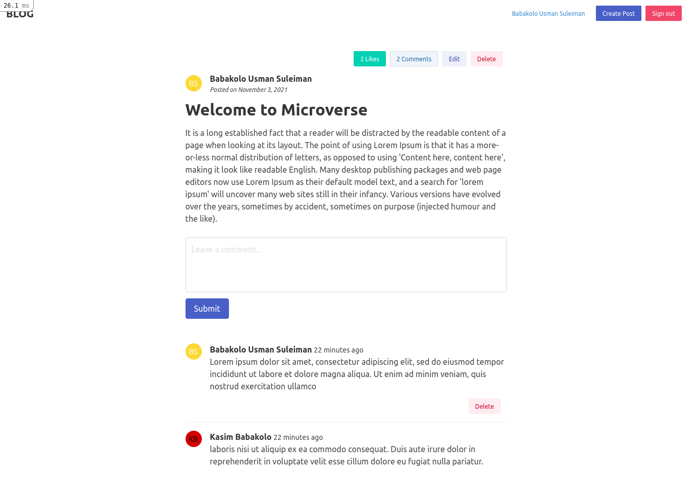

# Blog


> Classic blog website



Blog website that shows a list of posts and empower readers to interact with them by adding comments and liking posts.

## Built With

- Ruby on Rails
- PostgreSQL

## Getting Started

To get a local copy up and running follow these simple example steps.

### Prerequisites

- [Ruby](https://www.ruby-lang.org/en/)
- [Rails](https://gorails.com/)

### Setup

- Make sure you have Ruby on Rails set up properly on your computer
- Clone or download this repo on your machine
- Enter project directory

### Development Database

```sh
# Create user
sudo -u postgres createuser blog -s

# Create the database
rake db:create

# Load the schema
rails db:schema:load

## To apply a new migration run
rails db:migrate
```

### Install

```sh
bundle install
```

### Run

```sh
rails s
```

### Test

```sh
rake spec
```

## Authors

👤 **Usman**

- GitHub: [@usmansbk](https://github.com/usmansbk)
- Twitter: [@usmansbk](https://twitter.com/usmansbk)
- LinkedIn: [Usman Suleiman Babakolo](https://linkedin.com/in/usmansbk)

## 🤝 Contributing

Contributions, issues, and feature requests are welcome!

Feel free to check the [issues page](../../issues/).

## Show your support

Give a ⭐️ if you like this project!

## Acknowledgments

- Microverse

## License

[MIT](./LICENSE)
